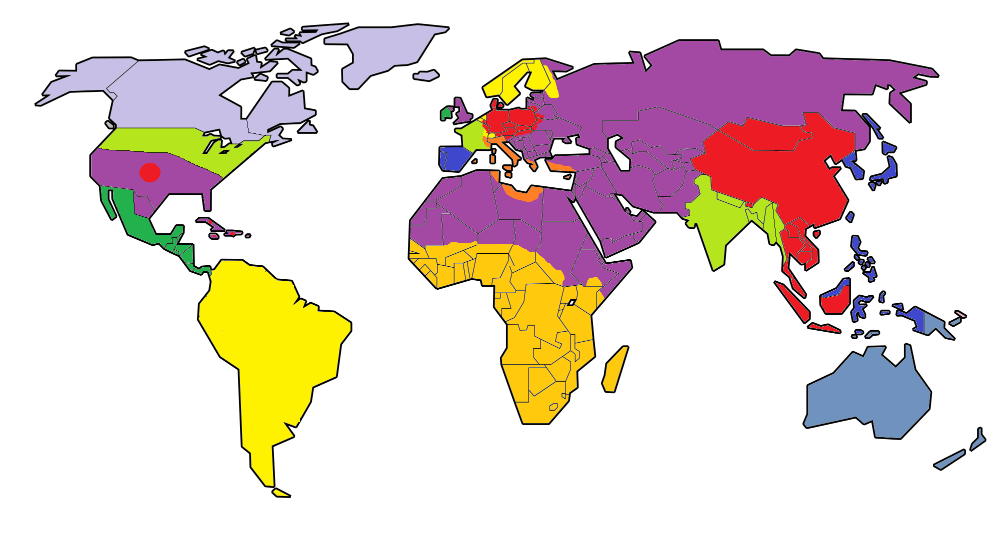

[Back](2020)

What happened in 2020?

Keemstar wants to invade Leafy because he roasted him
on Twitter. To do so, he forms an alliance with DanTDM and
Pyrocynical to invade Belgium and France. They crush Bashur in
Belgium and begin to move into France. Leafy asks the help
of h3h3 and jacksepticeye. They agree to blockade the Strait
of Gibralter and the coast of Sweeden, Germany, and Denmark.
This causes the Central Alliance to invade the ORMY (in search
of more coast to continue trade) and the ORMY joins in against
the Central Alliance. The Mindcrack Confederacy see their
opportunity and begin to push back the ORMY in Africa.
This begins World War 3.

The BDC and PUNB sucessfully conquer the U.S.   Pewdiepie flees
to Central America.

## N. America
Light Green - NormalBoots 
Lavender - CPO 
Dark Green - jacksfilms 
Purple and red - BDC

## S. America
Fascist Monarchy Of Butter

## Europe
Dark Blue - AntVenom 
Light Green - LeafyIsHere 
Purple - h3h3productions 
Dark Green - jacksepticeye 
Mid-Blue - Bashurverse 
Red - Keemstar 
Yellow - DanTDM 
Orange - Pyrocynical 
Purple - ORMY

## Africa
Orange - Mindcrack Confederacy (Mindcrack YouTubers) 
Purple - ORMY

## Asia/Oceania/Middle East
Purple - ORMY 
Red - EmpLemon 
Light Green - HowtoBasic 
Dark Blue - Bill Wurtz 
Mid-Blue - SMG4
