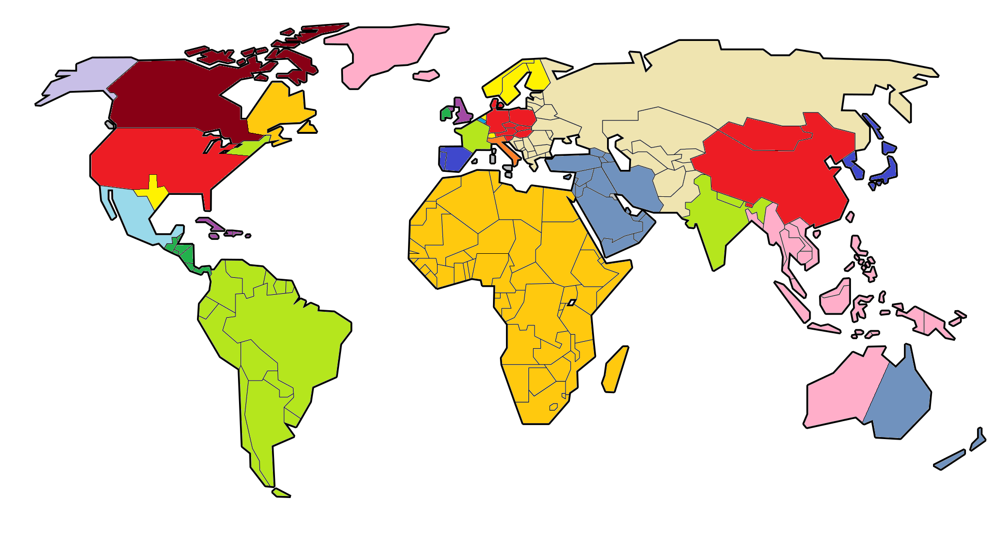

[Back to main page](https://teamcstudios.github.io/)

At the beginning of 2017, the governments of the world and the United Nations are suddenly disolved, and a new order rises to take their place: YouTubers. YouTubers divide the world up amongst themselves. Everything is peaceful... For a few days.

Maps "Year"
are of January 1st of said year, events (YEAR)
are everything that happened in that year.

N. America 
Red - Pewdiepie 
Light Green - NormalBoots 
Yellow - PBG 
Dark Red - Markiplier 
Lavender - LordMinion777 
Orange - Muyskerm 
Pink - yamimash 
Light Blue - nigahiga 
Dark Green - jacksfilms 
Purple - MrJoCrafter, ChewLeKitten, DjSlime, TheRedBrit,
ZachAttack, RodGods, lilpookie2000, ThePlayaKing, Jdogplayz 
(too lazy to divide it up)

S. America 
Team Crafted (too lazy to divide it) 

Europe 
Dark Blue - AntVenom 
Light Green - LeafyIsHere 
Purple - h3h3productions 
Dark Green - jacksepticeye 
Mid-Blue - Bashurverse 
Red - Keemstar 
Yellow - DanTDM 
Orange - Pyrocynical 

Africa 
Mindcrack Confederacy (Mindcrack YouTubers) 

Middle East 
Prank/Drama channels (too lazy to divide it) 

Asia/Oceania 
Tan - PinkSheep, ExplodingTNT, PurpleShep, Failboat,
and all their friends/fan channels. Also, not going to
divide it. 
Red - EmpLemon 
Light Green - HowtoBasic 
Dark Blue - Bill Wurtz 
Pink - CringeTubers 
Mid-Blue - SMG4 
